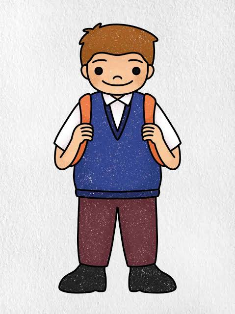

## Van bestellen naar zelf koken 
 

Een website dat mensen motiveert om zelf thuis te gaan koken 

Team naam: Chefs cooking 

Teamleden: Atakan Erdem, Thomas Rijsdijk, Maurits De Vries 

Opleiding: Software developer 

 

 

## Het probleem: 

Veel studenten eten vaak buiten de deur of bestellen eten. Dit komt bijvoorbeeld doordat ze moe zijn, weinig tijd hebben of niet weten wat ze moeten koken. 

Zelf koken kan soms lastig lijken. Je moet bedenken wat je gaat maken, boodschappen doen en daarna nog koken. Eten bestellen is dan veel makkelijker. 

Wij willen dit probleem oplossen door studenten te helpen om makkelijker zelf te koken. 

 

 

 

 

 

 

 

 ## Onze doelgroep: 

Onze doelgroep zijn jonge studenten. 

Studenten hebben vaak een druk leven en niet veel te spenderen. Daarom willen wij recepten aanbieden die: 

makkelijk zijn 

niet veel tijd kosten 

niet te duur zijn 

lekker zijn 

niet veel kookervaring nodig hebben 

 

## Onze oplossing: 

Wij willen een website maken speciaal voor studenten. 

Op de website kunnen studenten makkelijk een recept vinden. Ze kunnen bijvoorbeeld kiezen voor een goedkoop recept of een recept dat snel klaar is. 

De website kan ook een boodschappenlijst maken. Hierdoor weet de student meteen wat hij of zij moet kopen. 

 

## Waarom denken wij dat dit werkt? 

Wij maken koken makkelijker. 

Een student hoeft niet lang te zoeken naar een recept. De student kan gewoon aangeven wat hij of zij zoekt. 

**Bijvoorbeeld:**

"Ik heb €5 en 20 minuten." 

De website kan dan recepten laten zien die hierbij passen. 

Zo maken we de keuze om zelf te koken makkelijker dan eerst bedenken wat je moet eten, recepten zoeken en een boodschappenlijst maken. 

 

 

Wat maakt onze website anders? 

Er zijn al veel websites met recepten. Onze website is speciaal gericht op studenten. 

Wij letten vooral op: 

**prijs** 

**tijd** 

**makkelijk koken** 

**motivatie** 

**Alles staat op 1 plek.** 

 

 

## Ons doel 

Ons doel is simpel: 

Wij willen studenten helpen om vaker zelf thuis te koken. 

Niet door koken moeilijker te maken, maar juist door het makkelijker en leuker te maken. 

Minder bestellen. Meer zelf koken. 

 

 

 

## Onze wireframes: 

**Zo gaat onze website eruit zien:** 

 

 